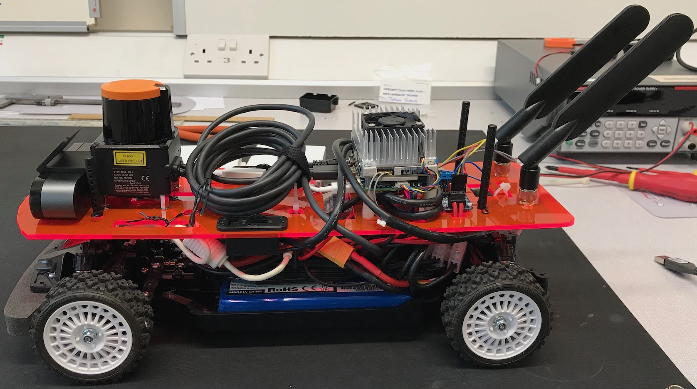

# RTS York Autonomous RC Car

The RTS York Autonomous RC Car platform is a 1/10th scale remote-control car chassis with an NVIDIA Jetson TX2, lidar, camera and other sensors mounted on it for autonomous control.

Hardware, software and ideas are based on a combination of the [F1TENTH](https://f1tenth.org/), [MIT RACECAR](https://racecar.mit.edu) and [RACECAR/J](https://racecarj.com/) projects.
